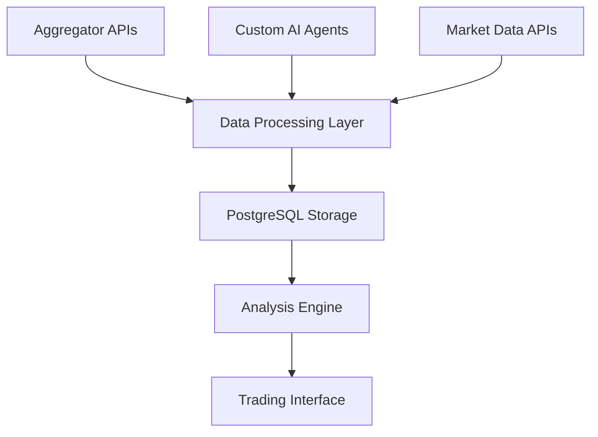

# Crypto Intelligence Platform: Hybrid Social Sentiment Implementation Specification

## Overview
This document outlines the implementation strategy for integrating social sentiment analysis into our crypto trading platform using a hybrid approach combining established aggregators with custom AI agents.

## 1. Architecture Overview

### 1.1 Data Collection Layer


### 1.2 Component Stack
- Frontend: React + TypeScript
- Backend: Node.js/Express
- Database: PostgreSQL
- AI Integration: OpenAI GPT-4o
- Data Sources: CryptoCompare, Fear & Greed Index, Custom Agents

## 2. Data Sources

### 2.1 Primary Aggregators
1. **CryptoCompare**
   - Already integrated
   - Provides market data, basic social metrics
   - Rate Limits: 250k calls/month (current tier)
   - Data refresh: Every 1 minute

2. **Fear & Greed Index**
   - Implementation status: Complete
   - Provides market sentiment overview
   - Rate Limits: 100 calls/hour
   - Data refresh: Every 24 hours

### 2.2 Custom AI Agents

#### 2.2.1 Telegram Monitor
- Status: Framework ready
- Target Groups: Major crypto communities
- Data Collection:
  * Message volume
  * Sentiment analysis
  * Keyword tracking
  * User engagement metrics

#### 2.2.2 Reddit Monitor (Planned)
- Target: r/CryptoCurrency, r/Bitcoin, etc.
- Features:
  * Post sentiment analysis
  * User activity tracking
  * Awards and engagement metrics
  * Historical trend analysis

#### 2.2.3 GitHub Activity (Planned)
- Metrics:
  * Commit frequency
  * Issue tracking
  * Developer engagement
  * Release analysis

## 3. Data Storage Schema

### 3.1 Database Tables

```sql
-- Reddit Posts
CREATE TABLE reddit_posts (
    id SERIAL PRIMARY KEY,
    post_id TEXT UNIQUE NOT NULL,
    title TEXT NOT NULL,
    content TEXT,
    url TEXT NOT NULL,
    score INTEGER NOT NULL,
    num_comments INTEGER NOT NULL,
    sentiment_score NUMERIC NOT NULL,
    created_at TIMESTAMP NOT NULL,
    updated_at TIMESTAMP DEFAULT NOW()
);

-- Market History
CREATE TABLE market_history (
    id SERIAL PRIMARY KEY,
    symbol TEXT NOT NULL,
    price NUMERIC NOT NULL,
    volume NUMERIC NOT NULL,
    market_cap NUMERIC,
    timestamp TIMESTAMP NOT NULL
);

-- Technical Indicators
CREATE TABLE technical_indicators (
    id SERIAL PRIMARY KEY,
    symbol TEXT NOT NULL,
    indicator_type TEXT NOT NULL,
    value NUMERIC NOT NULL,
    parameters JSONB,
    timestamp TIMESTAMP NOT NULL
);
```

## 4. Implementation Phases

### Phase 1: Foundation (Current)
- [x] Basic agent framework
- [x] Fear & Greed Index integration
- [x] Database schema setup
- [x] Market data integration

### Phase 2: Core Agents (Next)
- [ ] Telegram bot implementation
- [ ] Reddit data collection
- [ ] Sentiment analysis pipeline
- [ ] Historical data storage

### Phase 3: Advanced Features
- [ ] GitHub activity tracking
- [ ] Discord integration
- [ ] Advanced sentiment metrics
- [ ] Trend analysis

### Phase 4: Optimization
- [ ] Performance tuning
- [ ] Rate limit optimization
- [ ] Data retention policies
- [ ] Scaling considerations

## 5. Technical Implementation Details

### 5.1 Agent Framework
```typescript
interface SocialMetric {
    timestamp: string;
    source: string;
    sentiment_score: number;
    volume: number;
    engagement: number;
}

abstract class BaseAgent {
    protected task: AgentTask;
    abstract collect(): Promise<SocialMetric[]>;
    protected analyzeSentiment(text: string): Promise<number>;
}
```

### 5.2 Sentiment Analysis Pipeline
1. Text Collection
2. Preprocessing
3. OpenAI Analysis
4. Score Normalization
5. Storage & Aggregation

### 5.3 Data Flow
1. Agents collect raw data
2. Sentiment analysis performed
3. Data stored in PostgreSQL
4. Aggregated metrics computed
5. Real-time updates to UI

## 6. API Endpoints

### 6.1 Social Sentiment
```typescript
GET /api/sentiment/overview
GET /api/sentiment/coin/:symbol
GET /api/sentiment/historical/:symbol
POST /api/sentiment/analyze
```

### 6.2 Market Data
```typescript
GET /api/market/data/:symbol
GET /api/market/fear-greed
GET /api/market/social-volume
```

## 7. Monitoring and Maintenance

### 7.1 Health Checks
- Agent status monitoring
- API rate limit tracking
- Database performance metrics
- Sentiment analysis quality

### 7.2 Backup Strategy
- Daily database backups
- Agent configuration versioning
- Sentiment model checkpoints

## 8. Future Expansions

### 8.1 Planned Features
- RAG implementation with Pinecone
- Custom sentiment models
- Advanced technical analysis
- Multi-source correlation

### 8.2 Scaling Considerations
- Horizontal scaling of agents
- Cache implementation
- Rate limit management
- Data archival strategy

## 9. Testing Strategy

### 9.1 Unit Tests
- Agent data collection
- Sentiment analysis
- Data storage operations

### 9.2 Integration Tests
- End-to-end data flow
- API endpoint validation
- UI component testing

## 10. Security Considerations

### 10.1 Data Protection
- API key management
- Rate limit enforcement
- Data encryption
- Access control

### 10.2 Monitoring
- Error tracking
- Performance monitoring
- Security auditing
- Rate limit alerts
