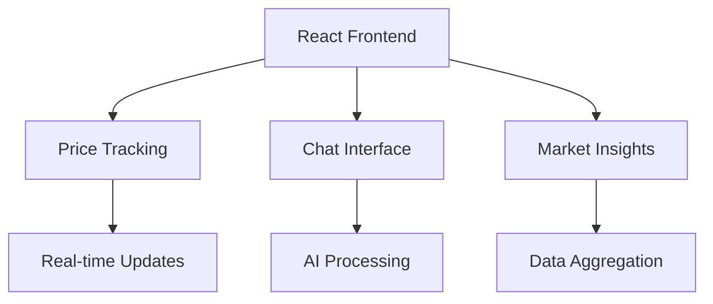

interface TrendingData {
  topic: string;
  sentiment: number;
  volume: number;
  momentum: number;
  sources: string[];
}
```

### 2. Market Insights Panel (Not Populated)
Current Status: UI ready but missing data integration
Implementation Plan:
- Real-time news aggregation
- Social sentiment analysis
- Technical indicator summaries
- Volume analysis
- Notable market events

Data Sources to Add:
1. Reddit (r/cryptocurrency, r/bitcoin)
2. Twitter crypto influencers
3. GitHub development activity
4. Telegram channels
5. Discord servers

## Development Roadmap

### Phase 1: High Priority
- [ ] Mobile Optimization
  - Design tab-based layout
  - Implement responsive components
  - Add mobile navigation
  - Test on various devices
- [ ] Enhanced AI Responses
  - Improve conversation flow
  - Add context awareness
  - Enhance market analysis depth
  - Implement memory for follow-up questions

### Phase 2: Medium Priority
- [ ] Trending Data Implementation
  - Social sentiment integration
  - Topic extraction pipeline
  - Volume analysis
- [ ] Market Insights Population
  - News aggregation
  - Technical analysis
  - Event detection
- [ ] Additional Data Sources
  - Reddit integration
  - Twitter sentiment analysis
  - Telegram monitoring
- [ ] Social Sentiment Tracking
  - Multi-source correlation
  - Sentiment analysis pipeline
  - Historical tracking

### Phase 3: Low Priority
- [ ] Advanced Features
  - Portfolio tracking
  - Custom alerts
  - Trading strategy backtesting
- [ ] Custom Indicators
  - Indicator builder interface
  - Custom formula support
  - Backtesting tools
- [ ] Portfolio Tools
  - Portfolio analytics
  - Performance tracking
  - Risk assessment

## Technical Architecture

### Frontend


### Backend
- Node.js/Express server
- PostgreSQL database
- WebSocket real-time updates
- OpenAI integration
- Social data aggregators

### Data Flow
1. Market data collection (CryptoCompare)
2. Social sentiment aggregation
3. AI processing & analysis
4. Real-time client updates

## Immediate Action Items

### 1. Mobile Experience
- [ ] Design tab-based layout
- [ ] Implement responsive components
- [ ] Add mobile navigation
- [ ] Test on various devices

### 2. AI Improvements
- [ ] Enhance conversation flow
- [ ] Add context awareness
- [ ] Improve market analysis depth
- [ ] Implement memory for follow-up questions

### 3. Data Sources
- [ ] Configure Reddit API integration
- [ ] Set up Twitter data collection
- [ ] Implement news aggregation
- [ ] Add social volume tracking

## Testing & Validation

### 1. Performance Metrics
- Page load time < 2s
- Real-time updates < 500ms
- API response time < 1s
- Mobile rendering < 3s

### 2. User Experience
- Mobile usability testing
- A/B testing for layouts
- User feedback collection
- Performance monitoring

## Security Considerations

### 1. Data Protection
- API key management
- Rate limiting
- Data encryption
- Session management

### 2. Error Handling
- Graceful degradation
- Fallback options
- User notifications
- Error logging

## Next Steps
1. Begin mobile optimization
2. Enhance AI conversation context
3. Design mobile layout mockups
4. Test responsive components
5. Implement trending data flow

### Priority Matrix
```
High Priority:
- Mobile optimization
- Enhanced AI responses

Medium Priority:
- Trending data implementation
- Market insights population
- Additional data sources
- Social sentiment tracking

Low Priority:
- Advanced features
- Custom indicators
- Portfolio tools